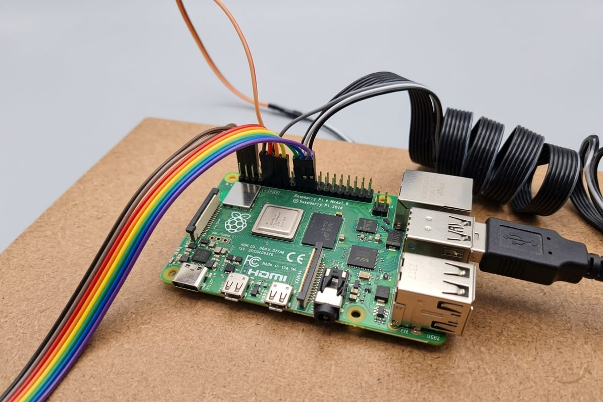
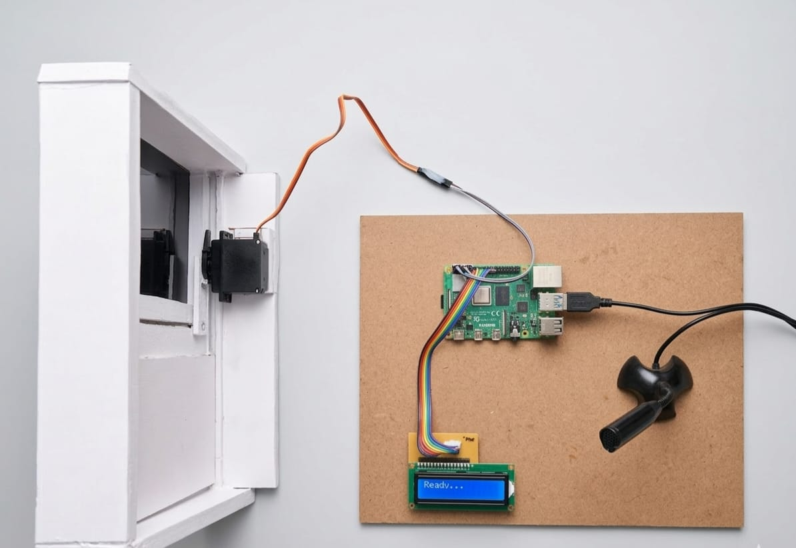
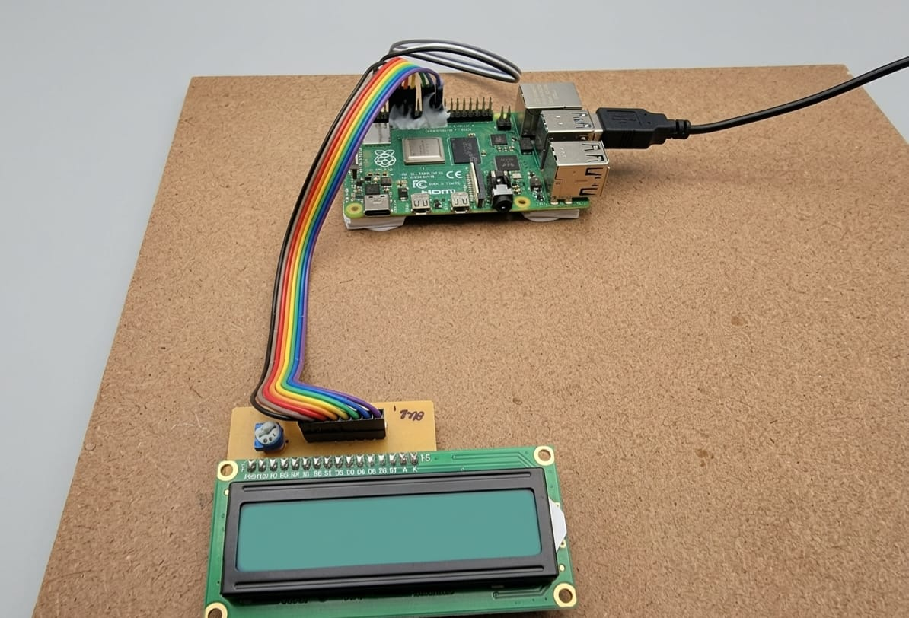
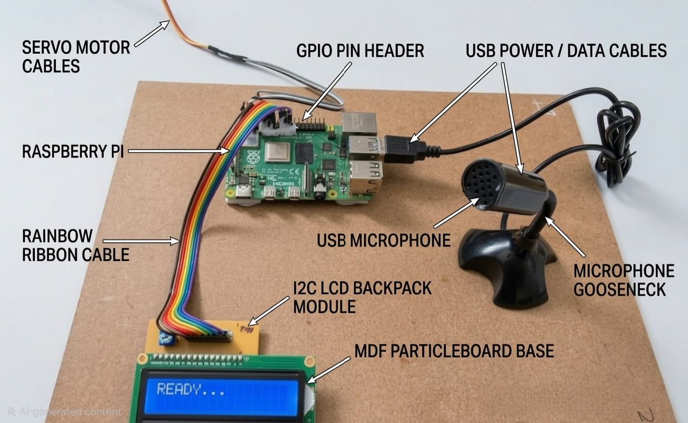

# TinyML Voice-Controlled Door System

> Real-time voice recognition system using TinyML on Raspberry Pi 4

[](portfolio.html)
[](https://python.org)
[](https://tensorflow.org/lite)
[](LICENSE)

---

## Interactive Portfolio

**[ View Interactive Portfolio](portfolio.html)** - Complete project showcase with demo video

---

## Project Overview

A voice-controlled door automation system powered by TinyML (Tiny Machine Learning). The system runs a 117KB neural network on a Raspberry Pi 4 to recognize "open" and "close" voice commands with 95% accuracy in real-time.

### Key Features

- **Real-time Voice Recognition** - 1-second audio processing windows
- **Edge Computing** - Runs entirely on Raspberry Pi (no cloud/internet)
- **High Accuracy** - 95% accuracy on real-world testing
- **Low Latency** - ~47ms inference time
- **Tiny Model** - Only 117KB model size (30,020 parameters)
- **Safety Features** - 80% confidence threshold + 3-second cooldown

---

## System Architecture

```
Microphone → MFCC Features → TinyML Model → Decision → Servo Control
   (16kHz)     (13 coeffs)   (CNN 117KB)    (80% conf)   (0°/175°)
```

### Hardware Components

| Component | Specification | Purpose |
|-----------|---------------|---------|
| **Raspberry Pi 4** | 4GB RAM, Quad-core ARM | Runs TFLite inference |
| **USB Microphone** | 16kHz sampling | Audio capture |
| **16x2 LCD Display** | I2C interface | Status display |
| **Servo Motor** | SG90 180° | Door actuation |
| **I2C Backpack** | PCF8574 | LCD simplification |

---

## Performance Metrics

| Metric | Value |
|--------|-------|
| Overall Accuracy | 95% |
| "Open" Precision | 90% |
| "Close" Precision | 100% |
| Inference Time | 47ms avg |
| Model Size | 117KB (float32) |
| Power Consumption | ~5W |
| Training Samples | 2,121 raw / 8,484 augmented |

---

## Quick Start

### Prerequisites

```bash
# Hardware
- Raspberry Pi 4 (4GB RAM recommended)
- USB Microphone
- 16x2 LCD Display with I2C backpack
- Servo Motor (SG90 or similar)
- MicroSD Card (16GB+) with Raspberry Pi OS

# Software
- Python 3.7+
- TensorFlow Lite Runtime
- Required Python packages (see requirements.txt)
```

### Installation

```bash
# 1. Clone repository
git clone https://github.com/yourusername/tinyml-voice-door.git
cd tinyml-voice-door

# 2. Install dependencies
pip3 install -r requirements.txt

# 3. Enable I2C interface
sudo raspi-config
# Navigate to: Interface Options → I2C → Enable

# 4. Run the system
python3 7882_project_final.py
```

### Wiring Connections

```
LCD Display (I2C):
├── VCC → 5V (Pin 2)
├── GND → Ground (Pin 6)
├── SDA → GPIO 2 (Pin 3)
└── SCL → GPIO 3 (Pin 5)

Servo Motor:
├── Red (VCC) → 5V (Pin 4)
├── Brown (GND) → Ground (Pin 14)
└── Orange (Signal) → GPIO 18 (Pin 12)

USB Microphone:
└── Any USB port
```

---

## Technical Details

### Machine Learning Model

- **Architecture**: Depthwise Separable Convolutional Neural Network (CNN)
- **Input**: 13 MFCC coefficients (39 with delta/delta-delta)
- **Output**: 4 classes (open, close, noise, unknown)
- **Framework**: TensorFlow → TFLite conversion
- **Optimization**: Post-training quantization (float32 → int8 available)

### Audio Processing

- **Sample Rate**: 16kHz (Nyquist: up to 8kHz)
- **Window Size**: 1 second (16,000 samples)
- **Feature Extraction**: MFCC (Mel-Frequency Cepstral Coefficients)
- **Channels**: Mono

### Safety Mechanisms

- **Confidence Threshold**: 80% (prevents false positives)
- **Cooldown Timer**: 3 seconds (prevents rapid repeated triggers)
- **Error Handling**: Graceful shutdown and GPIO cleanup

---

## Project Structure

```
tinyml-voice-door/
├── portfolio.html                           # Interactive portfolio page
├── Project.mp4                              # Demo video
├── 7882_project_final.py                    # Main production code
├── door_model.tflite                        # Trained TinyML model
├── requirements.txt                         # Python dependencies
├── README.md                                # This file
├── Project_Image_*.jpeg                    # Hardware setup photos
└── docs/
    ├── code_explanation.docx                # Detailed code walkthrough
    └── setup_guide.md                       # Complete setup instructions
```

---

## Demo Video

Watch the complete system demonstration:

[▶View Demo Video](Project.mp4)

---

## Hardware Setup

<table>
  <tr>
    <td></td>
    <td></td>
  </tr>
  <tr>
    <td align="center"><i>LCD and Raspberry Pi Connection</i></td>
    <td align="center"><i>Complete System with Door</i></td>
  </tr>
  <tr>
    <td></td>
    <td></td>
  </tr>
  <tr>
    <td align="center"><i>Raspberry Pi GPIO Connections</i></td>
    <td align="center"><i>All Components Labeled</i></td>
  </tr>
</table>

---

## Usage

### Basic Operation

```bash
# Start the system
python3 7882_project_final.py

# System will display: "TinyML Voice Door System Ready"
# LCD shows: "READY..."

# Say "OPEN" clearly → Door opens (servo rotates to 175°)
# Say "CLOSE" clearly → Door closes (servo rotates to 0°)

# Stop system
# Press Ctrl+C
```

### System Behavior

- **Listening**: Continuous 1-second audio windows
- **Processing**: MFCC extraction + TinyML inference (~47ms)
- **Decision**: Command accepted if confidence > 80%
- **Cooldown**: 3-second wait between commands
- **Feedback**: LCD displays status (READY/OPEN/CLOSED)

---

## Troubleshooting

### LCD Not Displaying

```bash
# Check I2C address
sudo i2cdetect -y 1
# Should show 0x27 or 0x3f

# Verify wiring connections
# Adjust contrast using potentiometer on I2C backpack
```

### Microphone Not Detected

```bash
# List audio devices
arecord -l

# Test recording
arecord -d 3 test.wav
aplay test.wav

# Try different USB port if needed
```

### Low Accuracy

- Speak 15-20cm from microphone
- Reduce background noise
- Speak clearly and distinctly
- Check microphone sensitivity: `alsamixer`

---

## Documentation

- **[Interactive Portfolio](portfolio.html)** - Complete project showcase
- **Code Explanation** - Line-by-line walkthrough (see docs/)
- **Setup Guide** - Detailed installation instructions
- **Technical Report** - Full project documentation

---

##Educational Value

This project demonstrates:

- **Machine Learning**: Training, optimization, deployment
- **Edge Computing**: TinyML on resource-constrained devices
- **Signal Processing**: Audio feature extraction (MFCC)
- **Embedded Systems**: Raspberry Pi GPIO control
- **IoT Integration**: Multi-component system design
- **Real-time Processing**: Low-latency inference

---

## Future Enhancements

- [ ] Multi-user voice authentication
- [ ] Web dashboard for remote monitoring
- [ ] Additional commands (lock, unlock, status)
- [ ] LED status indicators
- [ ] Audio feedback (TTS confirmations)
- [ ] Mobile app integration
- [ ] Battery power support

---

## License

This project is licensed under the MIT License - see the [LICENSE](LICENSE) file for details.

---

## Author

**Your Name**

- GitHub: [@yourusername](https://github.com/yourusername)
- Email: your.email@example.com
- LinkedIn: [Your LinkedIn](https://linkedin.com/in/yourprofile)

---

## Acknowledgments

- TensorFlow Lite team for the embedded ML framework
- Raspberry Pi Foundation for the hardware platform
- Librosa library for audio processing tools

---

## Show Your Support

Give a if this project helped you!

---

**Built with ❤️ using TinyML & Raspberry Pi**
